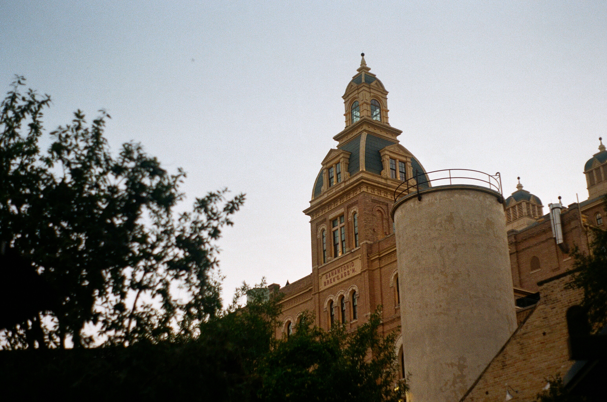
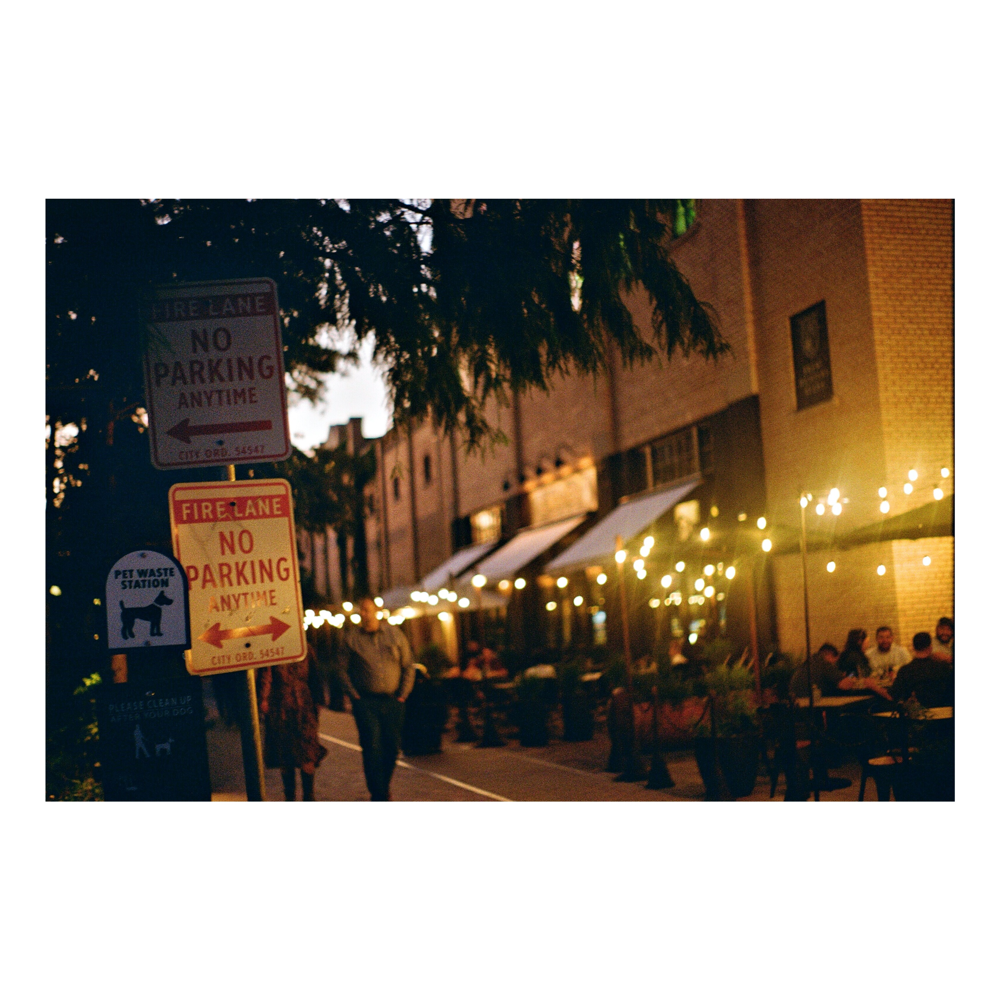

## Film Changer

|                                                                                              |                                                                                          |
| :------------------------------------------------------------------------------------------: | :--------------------------------------------------------------------------------------: |
|  blah |  |

A little utility CLI to make handling my film photography a bit easier. Currently only tested with JPGs.

## Usage

```sh
# Add Timestamps to Images to make them easier to manage in Google Photos
$ film timestamp [inputDir] [outputDir]

# Add those aesthetic borders for Instagram
$ film border [inputDir] [outputDir] [marginPercentage]
```

## Contributing

Pull requests are welcome. For major changes, please open an issue first to discuss what you would like to change.

## License

[MIT](https://choosealicense.com/licenses/mit/)
